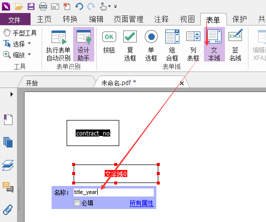
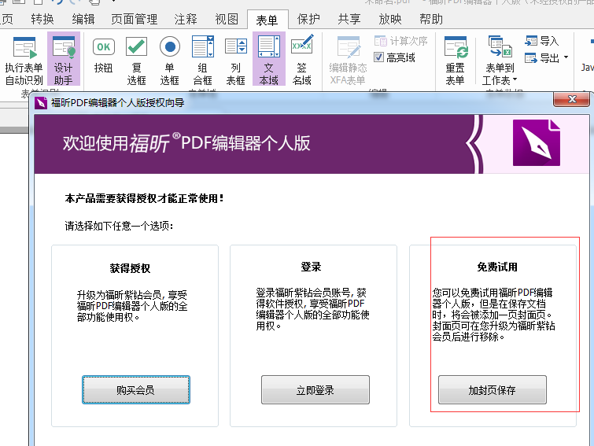
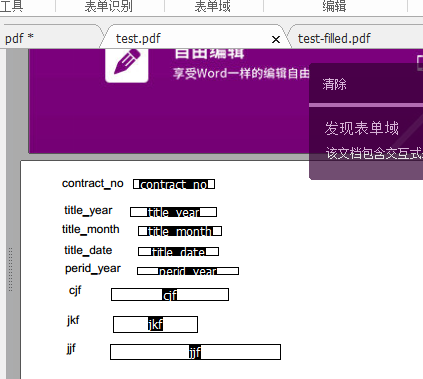
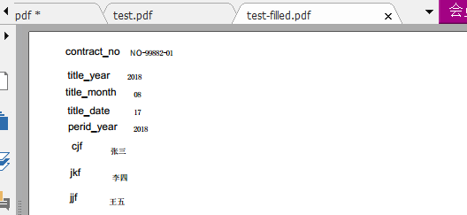
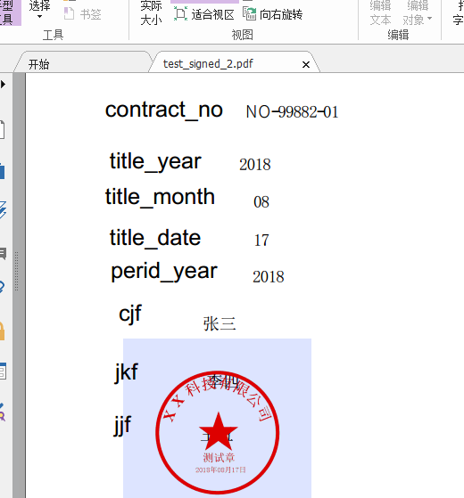
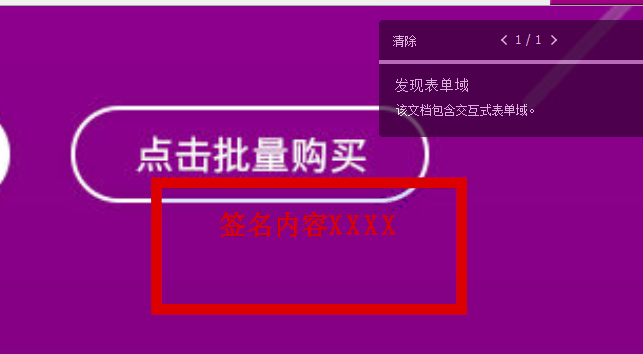

#  使用测试

## 生成证书信息

org.fui.sign.Pkcs#main

## 生成盖章图片

org.fui.utils.Graphics2DUtils

## 基于模板生成pdf

### 模板来源

福昕PDF编辑器，设计表单

n

### 保存表单

保存为text.pdf, 复制到run目录之下

### 用程序填写表单

执行: 

org.fui.utils.PdfUtils#main

表单

生成pdf结果

## 签章

org.fui.sign.SignPdf#main

结果

高清签章

org.fui.sign.SignHighPdf#main

结果：

## 参考

